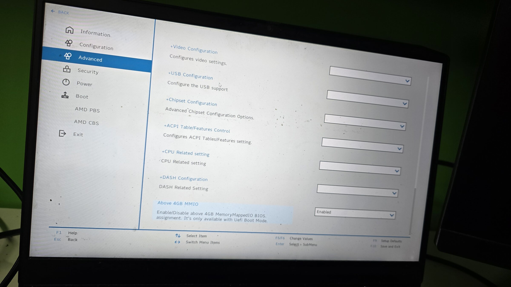

<div align="center">

# Lenovo IdeaPad Gaming 3 15ARH05 BIOS Research

**From a failed keyboard shortcut to a reverse-engineered, runtime EFI menu reveal**



[Create the USB](docs/USB_GUIDE.md) · [Advanced option inventory](docs/ADVANCED_OPTIONS.md) · [Photo gallery](docs/SCREENSHOTS.md) · [Research walkthrough](#1-starting-from-the-official-lenovo-update)

</div>

## Why this research started

I did not begin with an unlocked BIOS or even with proof that this laptop had an
`Advanced` menu. I only wanted to answer one question: **does the Lenovo IdeaPad
Gaming 3 15ARH05 contain the same hidden firmware controls reported on other
Lenovo models?**

Several reports suggested that combinations such as `Fn+R+N` could reveal extra
BIOS pages. Those sequences worked on some later Lenovo generations, but repeated
attempts did nothing on this specific 15ARH05. The ordinary setup interface gave
no indication that an Advanced form existed at all.

Rather than assume that the menu was absent, I wanted evidence from the firmware
itself. That turned a failed keyboard experiment into a reverse-engineering
project: recover the update image, locate the Setup Utility, decode its IFR,
prove whether a hidden form set existed, determine what controlled its
visibility, and finally test that finding on the physical machine.

## The path from question to proof

| Stage | Question or result |
|---|---|
| Keyboard tests | `Fn+R+N` and related sequences produced no visible change. |
| Firmware recovery | The official Lenovo updater was unpacked into a complete 16 MiB update ROM. |
| Platform analysis | The AMD PSP directory and reset-stage image were identified and extracted. |
| Setup reconstruction | The correct HII/IFR package revealed a complete form set titled `Advanced`. |
| Visibility analysis | The menu was not protected by one obvious IFR `SuppressIf` or setup-variable toggle. |
| Trigger identification | `H2OFormBrowserDxe` visibility entries associate each form-set GUID with a 32-bit shown/hidden flag. |
| EFI patch design | A model-tested SREP configuration changes those flags in memory and launches `SetupUtilityApp` before the patch disappears. |
| Physical validation | `Advanced`, `AMD PBS`, and `AMD CBS` rendered on the `FCCN19WW` test laptop. |

The effective trigger was therefore not a secret keyboard combination. It was
the runtime visibility state used by Lenovo's InsydeH2O form browser. The USB EFI
approach patches that state from hidden (`0`) to shown (`1`) for the relevant
form-set GUIDs, then opens the Setup Utility in the **same boot session**.

## The result

| Firmware evidence | Physical-machine evidence |
|---|---|
| Hidden `Advanced` form set recovered from IFR | `Advanced` rendered in Setup Utility |
| Form-set GUID and variable stores identified | `AMD PBS` and `AMD CBS` also became visible |
| Visibility trigger represented by GUID + shown flag | Combined runtime patch succeeded on `FCCN19WW` |
| No firmware flashing required for the reveal | 33 photographs preserve the successful session |

The [physical-test gallery](docs/SCREENSHOTS.md) is the final proof: the hidden
pages are present and can be exposed on this machine. This confirms menu
visibility only; it does not establish that changing any exposed value is safe.

> [!WARNING]
> This is firmware research, not a ready-to-flash modification. A wrong setup
> variable or firmware image can leave the laptop unable to display video or boot.
> The extracted update image is not a substitute for a verified, machine-specific
> SPI backup. The runtime menu reveal does not make the exposed settings safe,
> and no permanent firmware modification has been validated.

## Reproduce the runtime menu reveal

The complete, beginner-friendly procedure is in
**[SREP USB Creation and Boot Guide](docs/USB_GUIDE.md)**. It covers:

1. building the tested SREP revision or verifying an existing binary;
2. creating a GPT/FAT32 USB drive on Windows or Linux;
3. installing `BOOTX64.EFI` and the tracked configuration;
4. disabling Secure Boot and launching the USB in UEFI mode;
5. confirming the hidden menus, exiting without saving, and preserving
   `SREP.log`.

> [!IMPORTANT]
> Start with the dedicated guide instead of reconstructing the procedure from
> the research log below. The guide contains the exact file layout, source
> revisions, tested hash, safety checks, and troubleshooting table.

## Hardware and firmware context

The machine used for the investigation reports:

| Field | Value |
|---|---|
| Manufacturer | Lenovo |
| Product | `82EY` |
| Product version | `IP3GAMING-15ARH` |
| Installed BIOS | `FCCN19WW` |
| Analysed update | `FCCN21WW` |
| Secure Boot during EFI testing | Disabled |

The version difference is important. Structures found in the `FCCN21WW` update
must not be assumed to have identical addresses, byte patterns, module names, or
variable semantics in the installed `FCCN19WW` firmware.

Only original documentation, scripts, and experimental text configurations are
intended to be tracked. Lenovo/Insyde executables, firmware images, extracted
modules, variable dumps, logs, third-party source trees, and build products are
local research artifacts excluded by `.gitignore`.

## Current status

| Result | Status |
|---|---|
| Lenovo update package extracted | Confirmed |
| 16 MiB update ROM recovered | Confirmed |
| AMD PSP directory parsed | Confirmed |
| Reset-stage x86 image decompressed | Confirmed |
| Hidden `Advanced` form set found | Confirmed in `FCCN21WW` |
| Advanced option inventory recovered | Confirmed from IFR |
| Complete emulation in QEMU | Not achieved |
| `Fn+R+N` keyboard unlock | No effect on this machine |
| SREP EFI runtime menu reveal | **Confirmed on the `FCCN19WW` test machine** |
| Hidden `AMD PBS` and `AMD CBS` pages | **Confirmed at runtime** |
| Permanent firmware modification | Not attempted |

## Repository layout

```text
.
├── README.md
├── configs/
│   └── srep/
│       └── 15ARH05-FCCN21WW.cfg
├── docs/
│   ├── ADVANCED_OPTIONS.md
│   ├── SCREENSHOTS.md
│   └── USB_GUIDE.md
├── screenshots/
│   └── 33 optimized physical-test photographs
└── scripts/
    └── extract_reset_image.py
```

The paths used later in this document for firmware and extraction output describe
the local analysis workspace. Those files are deliberately not part of the Git
repository and must be produced from a legitimately obtained Lenovo update.

## 1. Starting from the official Lenovo update

Once the keyboard shortcuts had failed, the official update package became the
only reliable way to answer whether the menu existed on this firmware family.
The first objective was therefore to recover a form that could be inspected
without modifying or flashing the laptop.

The starting point was the official
[Lenovo BIOS Update for Windows 10 (64-bit) — IdeaPad Gaming 3 15ARH05](https://support.lenovo.com/us/en/downloads/ds545103-bios-update-for-windows-10-64-bit-ideapad-gaming-3-15arh05)
download page. The Windows BIOS updater obtained from that page was saved locally
as `artifacts/vendor/update-package/fccn21ww.exe`:

| Property | Value |
|---|---|
| Size | 7,476,808 bytes |
| SHA-256 | `1328423339f9d151282e342059491e4be36b9a59f9bb9a82743d9b184e16d682` |
| Format | Inno Setup, Windows x86 executable |

A normal 7-Zip extraction produced
`artifacts/vendor/outer-installer/[0]`, but that 7,286,304-byte file had
near-maximum entropy and was not directly usable. The useful payload was instead
captured by running the official installer under Wine and monitoring its temporary
files:

```bash
inotifywait -m -r \
  -e create,close_write,moved_to,delete \
  "$WINEPREFIX/drive_c/users" /tmp

wine artifacts/vendor/update-package/fccn21ww.exe
```

During execution, the installer staged a decrypted inner executable. It was
preserved as `artifacts/vendor/update-package/FCCN21WW.exe`:

| Property | Value |
|---|---|
| Size | 6,908,095 bytes |
| SHA-256 | `5593e5061f2cf0339f0f244f12a968f5f2195a44c0a71603828f9833fd4bdb70` |

Extracting that file with 7-Zip recovered the Insyde flashing package in
`artifacts/vendor/inner-package/`, including `H2OFFT-W.exe`, its drivers,
`platform.ini`, `BiosImageProc.dll`, and `BIOS.fd`.

## 2. Recovering the 16 MiB firmware image

`artifacts/vendor/inner-package/BIOS.fd` is not a raw flash dump. It is a 64-bit EFI executable
containing the flash driver, firmware payload, configuration, and certificate
data.

| Property | Value |
|---|---|
| Size | 18,077,344 bytes |
| SHA-256 | `495826940e5745995397fe18cf60f9ed2170bccc514b4c7d955b05796d1d7b82` |
| Format | PE32+ EFI application, x86-64 |

Its large `.reloc` section contains markers such as `$_IFLASH_DRV_IMG`,
`$_IFLASH_BIOSIMG`, and `$_IFLASH_INI_IMG`. The section and embedded driver were
recovered with:

```bash
objcopy --dump-section .reloc=artifacts/extracted/iflash/reloc.raw \
  artifacts/vendor/inner-package/BIOS.fd

dd if=artifacts/extracted/iflash/reloc.raw \
  of=artifacts/extracted/iflash/IFLASH_DRV_IMG.efi \
  bs=1 skip=$((0x78)) count=$((0x11380e8)) status=progress
```

The firmware payload starts at offset `0x129940` inside the recovered IFLASH
driver:

```bash
dd if=artifacts/extracted/iflash/IFLASH_DRV_IMG.efi \
  of=artifacts/extracted/iflash/firmware_payload.bin \
  bs=1 skip=$((0x129940))
```

The resulting payload is 16,835,040 bytes with SHA-256
`e8c78392bd193f9d3fbe38223a0d1d7638cd3e882b3db4deb98fd55e8527fd18`.
Inside it, `$_IFLASH_BIOSIMG` is at offset 448 and the raw 16 MiB image begins at
offset `0x1D8`:

```bash
dd if=artifacts/extracted/iflash/firmware_payload.bin \
  of=artifacts/firmware/FCCN21WW-update-16MiB.rom \
  bs=1 skip=$((0x1d8)) count=$((0x1000000))
```

`artifacts/firmware/FCCN21WW-update-16MiB.rom` is exactly 16,777,216 bytes and has SHA-256
`988209aea6660cf774d79a785ea3dcea98fb48a519c709715733c254320d10a8`.

This is the complete 16 MiB image distributed by the updater, but not necessarily
a complete backup of the physical laptop. Serial numbers, UUIDs, calibration
data, NVRAM state, and other board-specific information may only exist in the
machine's SPI flash. The embedded-controller firmware may also reside on a
separate device.

## 3. AMD PSP analysis

The ROM contains an AMD Platform Security Processor directory. PSPTool 3.6 stops
on this image with a strict key-store assertion:

```text
assert unknown_constants == (1, 2)
```

For read-only listing and extraction, Python's assertion-disabled mode allowed
the parser to continue:

```bash
.venv/bin/python -O .venv/bin/psptool \
  artifacts/firmware/FCCN21WW-update-16MiB.rom
.venv/bin/python -O .venv/bin/psptool \
  -X -n -u -o artifacts/extracted/psp \
  artifacts/firmware/FCCN21WW-update-16MiB.rom
```

This recovered PSP boot and recovery components, trusted OS and trustlets, SMU
and MP2 firmware, APCB data, PSP NVRAM/NV data, microcode, VBIOS preload, DMCU,
security policy/key material, and the compressed BIOS reset/copy image.

Using `python -O` suppresses every Python assertion. It is acceptable here only
as an explicitly understood parser workaround for read-only analysis. It must
not be used with PSPTool's replacement command (`-R`) or any firmware-writing
workflow.

The reset/copy entry is located at flash offset `0xF20000`; its zlib stream begins
at `0xF20100`. The repository script can reproduce the extraction:

```bash
python3 scripts/extract_reset_image.py \
  artifacts/firmware/FCCN21WW-update-16MiB.rom \
  artifacts/extracted/psp/BIOS_RESET_3M.bin
```

It produced:

| File | Size | SHA-256 |
|---|---:|---|
| `artifacts/extracted/psp/BIOS_RESET_3M.bin` | 3,145,728 bytes | `f89a3aac525f3177ad74fb07827aa458395a440a161f305d2026baf1b5ffddcc` |

Its final reset-vector bytes are:

```text
90 90 e9 eb e7 00 00 00 fb 00 00 00 00 00 b0 09
```

## 4. Why the firmware does not boot normally in QEMU

Mapping the update ROM directly as a conventional PC BIOS does not work because
the last bytes of the 16 MiB image are erased (`FF`). On the real AMD platform,
the PSP performs verification and preparation before the x86 reset stage runs.

The decompressed 3 MiB reset image does execute in QEMU. With an EPYC CPU model,
execution starts at `0xFFFFFFF0`, jumps to `0xFFFFE7E0`, performs AMD-specific
PCI configuration accesses, detects incompatible virtual hardware, and requests
a hard reset by writing `0x06` to I/O port `0xCF9`:

```asm
mov al, 0x06
mov dx, 0x0cf9
out dx, al
```

With `-no-reboot`, QEMU exits; without it, the VM continually resets. This is not
evidence that the extracted image is broken. QEMU's Q35 platform does not model
the Renoir PSP, Lenovo board chipset configuration, embedded controller, GPIOs,
or the other devices expected by this firmware. Relevant traces are retained in
`artifacts/logs/qemu-execution.log` and
`artifacts/logs/qemu-reset-image.log`.

## 5. Proving that the hidden Advanced menu exists

The extracted Setup Utility contains the ordinary Home, Information,
Configuration, Power, Security, Boot, and Exit form sets, plus a separate form
set titled `Advanced`.

The useful IFR output is:

```text
artifacts/extracted/uefi/SetupUtility.3.0.Advanced.en-US.uefi.ifr.txt
```

The `.3.4` paired dumps contain mismatched string packages; in particular,
`SetupUtility.3.4.AdvanceMenu.en-US.uefi.ifr.txt` has an invalid title mapping and
must not be used as the authoritative option inventory.

The recovered Advanced form set is:

| Property | Value |
|---|---|
| Form-set GUID | `C6D4769E-7F48-4D2A-98E9-87ADCCF35CCC` |
| Title | `Advanced` |
| Form ID | `0x0001` |
| Main variable store | `SystemConfig` |
| Variable GUID | `A04A27F4-DF00-4D42-B552-39511302113D` |
| Main VarStore ID / size | `0x1234` / `0x2BC` |
| Secondary store | `AdvanceConfig`, ID `0x1233`, size 8 |

There is no top-level IFR `SuppressIf` surrounding the Advanced form set. This
ruled out the simplest explanation: one obvious `SystemConfig` byte directly
controlling the whole menu from inside the IFR.

The relevant visibility mechanism lives in `H2OFormBrowserDxe`. Its form list
pairs a form-set GUID with a 32-bit shown/hidden field. In the patch patterns,
the GUID is followed by `00000000` when hidden; replacing it with `01000000`
changes that entry to shown. The successful physical test confirmed that this
visibility field is the effective runtime trigger on the tested environment.

This distinction matters. The discovery was not a guessed NVRAM offset and it
was not another keyboard shortcut. It provided a narrow runtime patch target
that could be tested without writing a modified image to SPI flash.

The IFR also contains disabled, unnamed numeric questions at `SystemConfig`
offsets `0x79`, `0x80`, and `0x81`, and at `AdvanceConfig` offsets `0x00` through
`0x07`. Their purpose is unknown. They are not evidence of an unlock byte and
must not be modified speculatively.

See [docs/ADVANCED_OPTIONS.md](docs/ADVANCED_OPTIONS.md) for the complete option
inventory recovered from the correct IFR file.

## 6. From the visibility trigger to a USB EFI patch

### Why the keyboard route was abandoned

The commonly reported `Fn+R+N` sequence was tried repeatedly without any visible
effect. Public reports of this sequence working often concern later Lenovo
15ACH6/ARH7 generations; reports for the 15ARH05 are inconsistent. It is not a
confirmed unlock method for this firmware.

### Engineering the runtime EFI patch — confirmed

Smokeless Runtime EFI Patcher (SREP) tag `0.1.4c` was built from source because
the upstream repository did not provide a current release asset. The build used:

| Component | Revision |
|---|---|
| SREP | `83d0ae47c9a48b3a2227aef06fb98a372c5ba354` |
| edk2 stable 202205 | `16779ede2d366bfc6b702e817356ccf43425bcc8` |

The resulting x86-64 EFI executable is 16,640 bytes with SHA-256
`79c46eb5fdb37ceb0aff7dcafa385c3f2cf018538f6e82704081242a714529da`.

A GPT-partitioned FAT32 USB drive was prepared with:

```text
EFI/BOOT/BOOTX64.EFI
SREP_Config.cfg
```

I used SREP as the runtime patch engine and designed the USB boot flow around the
discovered form-browser visibility mechanism. The tested configuration is
tracked as
[`configs/srep/15ARH05-FCCN21WW.cfg`](configs/srep/15ARH05-FCCN21WW.cfg). It uses
the combined Lenovo form-set patterns documented upstream for AMD PBS, AMD CBS,
Power, and Advanced, then launches `SetupUtilityApp` in the same boot session.

For the end-to-end build, USB preparation, boot, verification, and log-recovery
procedure, follow the [SREP USB Creation and Boot Guide](docs/USB_GUIDE.md).

The first prototype used only the Advanced GUID pattern and launched
`SetupUtility`. Its saved SREP log proves that the application and configuration
loaded, but reports `No Patter Found`. Entering the regular F2 setup after that
boot could not show a runtime patch because the patched environment was no
longer active.

That failure clarified two requirements: use the combined visibility patterns
and open the firmware's `SetupUtilityApp` before leaving the patched boot
environment. The rebuilt USB therefore used the combined form-set configuration
and launched `SetupUtilityApp` in the same boot session. This attempt succeeded
on the test laptop running `FCCN19WW`: the hidden `Advanced`, `AMD PBS`, and
`AMD CBS` menu entries became visible and their pages rendered correctly. The
result is documented in the [physical-test gallery](docs/SCREENSHOTS.md).

This confirms a **runtime menu reveal**, not a permanent unlock. The patch is
applied in memory for that boot path; the firmware image on SPI flash was not
modified. The photographs also do not establish that changing any exposed
setting is safe.

## 7. Recommended next steps

1. Preserve the successful run's `SREP.log` and record every module load,
   pattern-match, patch, and execution result alongside the photographs.
2. Re-run the procedure once without saving changes to confirm repeatability and
   document the exact boot sequence.
3. Obtain the exact `FCCN19WW` update package or, preferably, two identical reads
   from the laptop's physical SPI flash.
4. Extract `H2OFormBrowserDxe` and `SetupUtilityApp` from that exact firmware and
   confirm the UI section names and Advanced GUID pattern.
5. Compare the installed `FCCN19WW` IFR against the existing `FCCN21WW`
   inventory before associating photographed controls with variable offsets.
6. Keep further runtime sessions observation-only and exit without saving.
7. Before changing any firmware setting, prepare a verified hardware recovery
   path and preserve the original board-specific flash contents.

For a physical SPI backup, identify the flash chip and voltage first, use the
correct adapter, make at least two independent reads, compare their hashes, and
keep immutable copies. Also determine whether the embedded controller has a
separate flash device.

## High-risk settings

Do not experiment casually with display routing (`Hybrid Graphics`, dGPU/iGPU),
SATA/RAID or PCIe GPP configuration, PSP/fTPM/Secure Boot state, SVM/SMM locks,
memory timings and voltage, clocks or thermal limits, or the unnamed
`AdvanceConfig` fields. A public report for this laptop family describes a
no-display failure after changing graphics-related hidden settings.

## References

- [Lenovo BIOS Update for Windows 10 (64-bit) — IdeaPad Gaming 3 15ARH05](https://support.lenovo.com/us/en/downloads/ds545103-bios-update-for-windows-10-64-bit-ideapad-gaming-3-15arh05)
- [PSPTool](https://github.com/PSPReverse/PSPTool)
- [Smokeless Runtime EFI Patcher](https://github.com/barlowhaydnb/SmokelessRuntimeEFIPatcher)
- [flashrom classic CLI documentation](https://flashrom.org/classic_cli_manpage.html)
- [Reddit community discussion and follow-up](https://www.reddit.com/r/LenovoLegion/comments/1vsqzod/comment/p4o1d51/)
- [15ARH05 hidden-setting brick report](https://winraid.level1techs.com/t/problem-lenovo-ideapad-3-15arh05-corrupt-bios-settings/107542)
